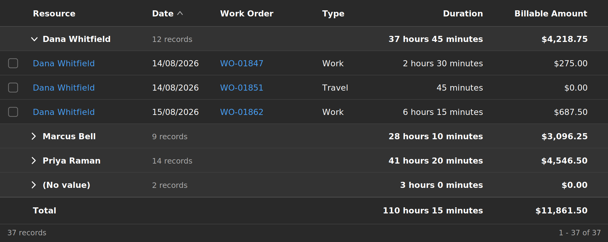

# Grouped Totals Grid

A PCF dataset control for model-driven apps. It renders any view grouped by a single column — **including lookup columns, which the native grid cannot group on** — and shows per-group and grand totals for every numeric column in the view, rendered in the platform's own cell formatting.


*Time entries grouped by Bookable Resource. Duration totals render as hours and minutes because that is how the cells above them render; the currency column carries its symbol and two decimal places for the same reason. The empty group sorts last. The grand total is pinned to the bottom.*

The control follows the app theme automatically:



---
# Note

This control wa built using Claude Code. 

---

## Quick start

```bash
npm install && npm run verify && dotnet restore
```

then package, import and configure following [docs/GETTING-STARTED.md](docs/GETTING-STARTED.md) — build to working grid in about 30 minutes.

---

## Why this exists

Model-driven views let a maker define columns, filters and sort order, and the Power Apps grid control added grouping and aggregation — but grouping is not available on lookup columns, which is the grouping people most often want. "Time entries by resource", "opportunities by account", "cases by owner" all hit that wall.

This control fills that gap and adds one thing the native aggregation does not guarantee: totals computed against the **full filtered result set** rather than whatever rows happen to be loaded.

## What it does

- Groups by any column, lookups included, with the related record's name as the group label.
- Auto-detects every totalable column in the view — Currency, Decimal, FP, Whole.None, Whole.Duration — and totals it. No per-column configuration.
- Renders each total exactly the way the platform renders the cells in that column: same precision, same currency symbol and placement, same locale separators, same duration shape.
- Computes totals server-side via a parallel FetchXML aggregate query, so the numbers are right regardless of paging, and partitions the query automatically when the result set exceeds the platform's aggregate limit.
- Falls back to summing loaded rows when the server path is unavailable, and says so rather than showing a partial total as if it were final.
- Preserves grid behaviour: row navigation, multi-select driving the standard command bar, sorting, view switching, theming.

## Formatting parity

This is the part that is easy to get wrong and the reason most of the test suite exists.

| Column renders as | Total renders as |
|---|---|
| `1,234.50` | `47,881.25` |
| `1.234,50 €` (de-DE) | `47.881,25 €` |
| `2 hours 30 minutes` | `110 hours 15 minutes` |
| `2:30` | `110:15` |
| `2.50 hours` | `110.25 hours` |
| `1 Stunde 30 Minuten` | `110 Stunden 15 Minuten` |

Duration is the hard case: Dataverse stores it as whole minutes and PCF exposes no duration formatter, so the control works out the shape **structurally** — it compares the numbers in the rendered string against the raw minute value to determine whether the platform used hours-and-minutes, colon notation, decimal hours or plain minutes, then reuses the platform's own surrounding text when rendering the total. That is why the German example above works without the control knowing any German.

The gate for all of this is in `__tests__/formatParity.test.ts`: a total over exactly one record is that record's value, so `formatTotal(value)` must equal that record's `getFormattedValue()` character for character. Any drift in precision, separators, symbol placement or duration shape fails the build.

## Architecture

```
index.ts                    PCF lifecycle. Thin - reads properties, hands off to React.
components/                 Rendering only. No arithmetic.
  columnLayout              Flex column sizing, shared by every row type.
  icons/                    Hand-drawn SVG, so no icon package is bundled.
hooks/                      Adapters between the PCF context and core/.
  useDatasetRows            Paging, up to maxClientRows.
  useColumnFormats          Metadata + sampled cells -> ColumnFormat per column.
  useAggregates             Server aggregate path, partitioning, client fallback.
core/                       Pure, PCF-free, unit tested.
  aggregation               Grouping, scaled-integer summing, mixed currency.
  fetchXmlBuilder           View FetchXML -> aggregate query.
  fetchXmlPartitioner       Aggregate-limit detection and splitting.
  formatters/               The parity logic.
  groupKey                  Group identity: one definition shared by client
                            bucketing, server parsing and row filtering.
  groupingPreference        Per-user, per-view grouping choice.
  queryHash                 What counts as "the query changed".
  nativeGridMetrics         Measured native styling, mapped to Fluent tokens.
```

Everything in `core/` takes plain data and returns plain data, so it can be tested without mocking a `ComponentFramework` context. That is where the logic lives; the components arrange it.

### Two paths, one shape

Rows come from the dataset API. Totals come from a separate aggregate query. They meet in the renderer. This is deliberate: rows from the dataset keep security trimming, record navigation and command-bar selection working correctly, while totals from the server stay correct on result sets far larger than the browser will ever hold.

## Design decisions worth knowing

- **A column with no numeric values totals to `null`, not `0`.** Blank is honest; a zero is a claim.
- **Sums use scaled integer minor units.** Naive float addition visibly diverges at two decimal places across thousands of rows. Tested at 10,000 rows.
- **Money is never summed across transaction currencies.** When a group spans currencies the control substitutes the base-currency sum and shows an info icon explaining the substitution.
- **Dates group on the local calendar day, not the UTC instant.** Dataverse stores UTC; grouping on the raw instant misfiles anything near midnight, which is how period totals end up off by a day.
- **Unknown filter operators cause a fallback, not a guess.** An aggregate query missing a filter would disagree with the rows on screen, which is worse than falling back to loaded rows and saying so.
- **The empty group always sorts last**, regardless of sort direction.
- **Columns are flex-sized, not pixel-sized.** `flexBasis: 0` with `flexGrow` from the view's `visualSizeFactor` means a row is exactly as wide as its container by construction, so no horizontal scrollbar appears from rounding, and the header cannot drift out of alignment with the body.
- **The control isolates its own stacking context.** Sticky rows layer against each other but can never paint over host chrome such as the dashboard selector.
- **The header menu only offers commands that work.** Filtering and column reordering are the platform's job, not a decorative duplicate here.

## Build and test

```bash
npm install
dotnet restore         # once, before any solution packaging
npm run build          # development bundle
npm run rebuild:prod   # clean + production bundle
npm test               # 150 unit tests across core/
npm run lint                 # eslint, via pcf-scripts (also runs inside build)
npm run lint:manifest        # guard: malformed XML comments, unescaped &, SDK-style pcfproj
npm run lint:versions        # guard: package.json / manifest / changelog agree
npm run lint:no-raw-colors   # guard: no hex/rgb literals or font stacks in styles
npm run verify         # all of the above
npm run verify:prod    # same, with a production build
```

## Documentation

| Document | Contents |
|---|---|
| [GETTING-STARTED.md](docs/GETTING-STARTED.md) | **Start here.** Build → package → import → configure, end to end |
| [DEPLOYMENT.md](docs/DEPLOYMENT.md) | Prerequisites, solution packaging, ALM, versioning, rollback |
| [CONFIGURATION.md](docs/CONFIGURATION.md) | Registering the control, every property, two worked examples, troubleshooting |
| [STYLE-PARITY.md](docs/STYLE-PARITY.md) | The native-grid parity checklist and evidence procedure |
| [DEPENDENCIES.md](docs/DEPENDENCIES.md) | What the install warnings and audit findings mean, and why they need no action |
| [KNOWN-LIMITATIONS.md](docs/KNOWN-LIMITATIONS.md) | What it cannot do, and why |
| [CHANGELOG.md](CHANGELOG.md) | Version history |

## Build status

Verified with `pcf-scripts` 1.51.1: `build`, `build --buildMode production` and `lint` all succeed, 150 tests pass, and the full control typechecks under `strict`. Running in a live Dataverse environment.

**Production bundle: 62 KB.** React and Fluent are externals supplied by the platform, and the control imports nothing else from a package - the icons in `components/icons` are hand-drawn SVG precisely so that `@fluentui/react-icons` (~1.4 MB, and not a platform library) stays out of the bundle.

## Status

Core logic is implemented and tested. Before this ships to a production environment, three things need doing against a real org — they are listed with detail in [KNOWN-LIMITATIONS.md](docs/KNOWN-LIMITATIONS.md):

1. Fill in `core/nativeGridMetrics.ts` from real measurements of the native grid. Narrower in scope than it was: column widths are now flex-distributed rather than computed in pixels, so what remains to measure is row heights, typography and the hover/selection colours.
2. ~~Verify the `platform-library` versions in the manifest.~~ **Done** - verified against `pcf-scripts` 1.51.1: React 16.8-16.14.0, Fluent 9.0.0-9.68.0. Recorded in the manifest.
3. Run the manual test matrix in [STYLE-PARITY.md](docs/STYLE-PARITY.md), including a dataset large enough to trigger the aggregate limit.
