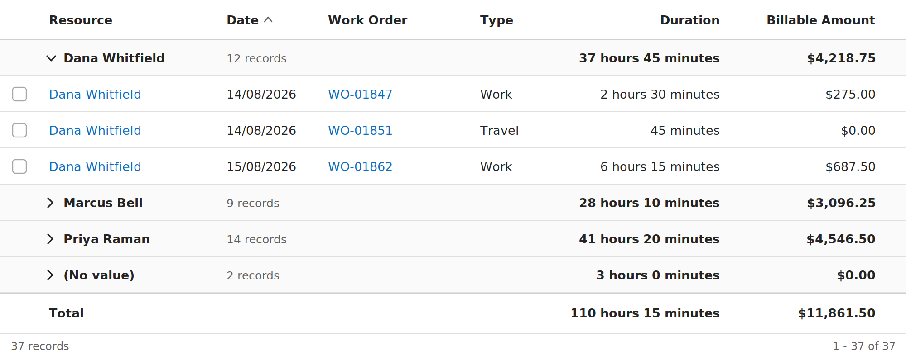

# Getting started

The whole path, once: source → solution → imported → configured → visible. Roughly 30 minutes the first time.

If you only want to test quickly in a development environment, skip to [The fast path](#the-fast-path-for-development-only) at the end.

---

## 1. Prerequisites

| Tool | Check with |
|---|---|
| Node.js LTS (18 or 20) | `node --version` |
| Power Platform CLI | `pac --version` |
| .NET SDK 6+ | `dotnet --version` |

**You do not need Visual Studio or MSBuild.** `dotnet build` handles everything below, on Windows, macOS and Linux alike. The component project targets `net462`, but it references `Microsoft.NETFramework.ReferenceAssemblies`, so the .NET SDK builds it without the .NET Framework installed.

If you prefer MSBuild, every `dotnet build` command below has an `msbuild` equivalent — but `msbuild` is only on your PATH inside the **Developer Command Prompt / Developer PowerShell for Visual Studio**, which is why a plain PowerShell window reports `The term 'msbuild' is not recognized`.

You need **System Administrator** or **System Customizer** on the target environment.

---

## 2. Build the control

```bash
cd D365PCF-GroupsAndTotals
npm install
npm run verify
```

`verify` runs the manifest guard, the style guard, 150 unit tests, and a full build. All four must pass.

Then restore the .NET side once:

```bash
dotnet restore
```

> `NU1100: Unable to resolve 'Microsoft.PowerApps.MSBuild.Pcf'` means NuGet cannot reach nuget.org. Check your NuGet sources; behind a corporate feed, the package needs mirroring.

**Checkpoint:** `out/controls/GroupedTotalsGrid/bundle.js` exists and is roughly 62 KB.

---

## 3. Package into a solution

Name the folder deliberately — `pac solution init` derives the solution's unique name from it, so a folder called `solution` produces a solution literally named "solution".

```bash
cd ..
mkdir GroupedTotalsGridSolution && cd GroupedTotalsGridSolution

pac solution init --publisher-name ONEConsultNET --publisher-prefix ONEC
pac solution add-reference --path ../../D365PCF-GroupsAndTotals
```

`--path` points at the folder **containing** `GroupedTotalsGrid.pcfproj` — not at the solution folder, and not at the `.pcfproj` file itself. It is also resolved relative to your **current directory**, so if you run this line on its own — for example by re-pasting just this command later — from inside `D365PCF-GroupsAndTotals` instead of from `GroupedTotalsGridSolution`, `pac` will report a path that doesn't exist. Run the whole block above together, or confirm with `pwd` that you are in the solution folder first.

**Checkpoint, and do not skip this one:** open the generated `.cdsproj` in a text editor and confirm a `ProjectReference` naming `GroupedTotalsGrid.pcfproj` is present. If it is missing, `add-reference` did not take, and everything after this produces a solution that imports with zero objects.

Build it. Run this from the **solution** folder — `dotnet build` restores and builds the referenced component project as part of the same command:

```bash
# Managed, for test and production
dotnet build --configuration Release

# Unmanaged, for a development environment
dotnet build --configuration Debug
```

<details>
<summary>MSBuild equivalents</summary>

From a **Developer Command Prompt for Visual Studio**:

```bash
msbuild /t:build /restore /p:configuration=Release
msbuild /t:build /restore /p:configuration=Debug
```

</details>

---

### If the build produces no zip

The symptom is a build that reports success while `bin/Debug` (or `bin/Release`) contains no `.zip` — typically just cache files and a `.FileListAbsolute.txt`, which are `obj/` artifacts. It means the packaging target never ran. Two causes, in order of likelihood:

**1. You ran it in the wrong folder.** `dotnet build` must run in the **solution** folder (the one holding the `.cdsproj`). Run in the control folder, it builds only the component project, which produces `out/controls` and no zip at all.

```bash
ls *.cdsproj        # you should be in the folder where this exists
```

**2. The `.pcfproj` is not SDK-style.** `dotnet build` builds SDK-style projects only; a legacy project file is skipped without a useful error, and the solution has nothing to package. The first line of `GroupedTotalsGrid.pcfproj` must be:

```xml
<Project Sdk="Microsoft.NET.Sdk">
```

If it instead has `ToolsVersion=`, an `xmlns="http://schemas.microsoft.com/developer/msbuild/2003"` attribute, or an import of `Microsoft.CSharp.targets`, it is legacy. Either convert it, or build with MSBuild from a Developer Command Prompt, which handles both styles. `npm run lint:manifest` checks this and fails with an explanation.

Two further checks if neither applies:

```bash
dotnet build --configuration Release -v normal    # look for the component project being built
```

and confirm the `.cdsproj` contains a `ProjectReference` naming `GroupedTotalsGrid.pcfproj`.

## 4. Verify the zip before importing

Sixty seconds here saves an import-and-wonder cycle.

```bash
unzip -l bin/Release/GroupedTotalsGridSolution.zip
```

**Expected:** a `Controls/ONEConsult.net.GroupedTotalsGrid/` folder containing `ControlManifest.xml`, `bundle.js` and `strings/`.

**If you only see** `solution.xml`, `customizations.xml` and `[Content_Types].xml`, the component was not included. Return to step 3 and check the `ProjectReference`.

---

## 5. Import in the maker portal

1. Go to **make.powerapps.com**.
2. Top right — confirm you are in the **correct environment**. This is the single most common misstep.
3. Left nav → **Solutions**.
4. Command bar → **Import solution**.
5. **Browse** → select `bin/Release/GroupedTotalsGridSolution.zip` → **Next**.
6. Review the solution details → **Import**. It takes a minute or two.
7. When it finishes, open the solution and confirm **Objects** lists the custom control rather than showing 0.

Then **Publish all customizations** from the Solutions command bar.

Via CLI instead, if you prefer:

```bash
pac auth create --environment https://yourorg.crm.dynamics.com
pac solution import --path ./bin/Release/GroupedTotalsGridSolution.zip --publish-changes --async
```

**Checkpoint:** the solution's Objects list is not empty.

---

## 6. Configure a view to use the control

Dataverse registers grid controls at the **table** level or per **subgrid**. There is no per-view registration, so pick based on scope.

### Option A1 — a dashboard (best for "hours by resource this month")

A dashboard is usually the right home for a grouped-totals view, because it is a destination in its own right rather than something bolted onto a record.

Dashboards call the component a **List**, not a subgrid. Use a **classic** dashboard — interactive dashboards do not expose the control configuration.

1. Solutions → open your solution → **New** → **Dashboard** → choose a classic layout (a 2-column layout gives the grid enough width).
2. The dashboard designer opens in a new browser tab. In an empty tile, click the **List** icon (the tile offers chart, list, iframe and web resource).
3. The **Set Properties** dialog opens. Set:
   - **Name** — e.g. `TimeEntryByResource`
   - **Label** — what users see above the grid
   - **Table** — e.g. Time Entry
   - **Default View** — the view you built
4. Switch to the **Controls** tab in that same dialog.
5. **Add Control…** → **Grouped Totals Grid** → **Add**.
6. In the row that appears, tick **Web** (and Phone / Tablet if wanted). This makes it the control for those clients.
7. Configure the properties: click the **pencil icon** beside each, choose **Bind to static value**, and enter the value. At minimum set **Group by column** to the **logical name**, e.g. `msdyn_bookableresource`.
8. **OK** → **Save** → **Publish**.
9. Add the dashboard to your app: open the app in the app designer, add the dashboard under **Pages**, save and publish. Use **Enable Security Roles** on the dashboard if it should not be visible to everyone.

To edit it later: open the dashboard, select the list, and use **Edit Component** on the designer toolbar to reopen Set Properties.

Give the list a wide tile. Below roughly 480px the control reflows to a card layout by design, which is right on a phone but not what you want in a half-width desktop tile.

### Option A2 — a subgrid on a form

Same idea, attached to a record. Use the modern form designer:

1. Solutions → your table → **Forms** → open the main form.
2. Add a **Subgrid** component, or select an existing one.
3. In the properties pane on the right:
   - **Table** → your table
   - **Default view** → the view you built
   - **Show view selection** → on, if users should be able to switch views
4. Still in the properties pane, expand **Components** → **+ Component**.
5. Choose **Grouped Totals Grid** from the list.
6. Tick the form factors: **Web**, **Phone**, **Tablet**.
7. Set the properties — at minimum **Group by column**, using the **logical name**.
8. **Save**, then **Publish**.

### Option B — every view of a table

This requires the **classic** solution explorer; the modern designer cannot register a control at table level.

1. make.powerapps.com → **Solutions** → open your solution.
2. Command bar → **…** (More) → **Switch to classic**. A new window opens.
3. Expand **Entities** → your table → **Controls** tab.
4. **Add Control…** → select **Grouped Totals Grid** → **Add**.
5. In the row that appears, tick **Web / Phone / Tablet** to make it the default for those clients.
6. For each property, click the **pencil icon**, choose **Bind to static value**, and enter the value.
7. **Save**, then **Publish**.

Be deliberate: this applies to *every* view of that table, including ones you had not considered. Pilot with Option A1 or A2 first.

---

## 7. Verify it works

Open the view, form or dashboard. You should see:



- Collapsible group rows, one per distinct value of the grouping column
- Totals on each group row, aligned under the column they total
- Duration totals in hours and minutes if the cells render that way
- Currency totals with the same symbol and decimal places as the cells
- A pinned **Total** row at the bottom
- `(No value)` sorted last, if any records have an empty grouping column

Expand a group and confirm the rows underneath match the total above them.

---

## 8. If something is off

| What you see | Check |
|---|---|
| The standard grid, not this one | Publish all customizations again, then hard refresh (Ctrl+F5). Control bundles are cached aggressively. |
| Solution imported with 0 objects | Step 4 — the zip did not contain the component. |
| Control missing from the component list | The import succeeded but customizations were not published. |
| Grid renders but no totals | The view has no totalable columns. Add a Currency, Decimal or Duration column to the **view layout** — the control will not total a column the user cannot see. |
| Groups all say `(No value)` | **Group by column** is wrong. Use the logical name. |
| "Totals cover the records loaded so far" | The server aggregate path fell back. Set **Enable debug logging** to Yes and check the browser console. |
| Deployed a change, nothing changed | The control version was not incremented. Bump `<control version>` in the manifest, rebuild, reimport, publish, hard refresh. |
| `msbuild : The term 'msbuild' is not recognized` | Use `dotnet build` instead — it needs no Visual Studio. Or open the **Developer PowerShell for VS**, where `msbuild` is on the PATH. |
| `MSB4057: the target "CreateManifestResourceNames" does not exist` | An MSBuild/.NET Framework mismatch. Use `dotnet build` instead. |
| Build succeeds but `bin/Debug` holds only cache files and a `.txt` | Wrong folder, or a legacy (non-SDK) `.pcfproj`. See "If the build produces no zip" above. |

Fuller troubleshooting in [CONFIGURATION.md](CONFIGURATION.md). Every property is documented there, with two worked examples.

---

## The fast path, for development only

To iterate without packaging a solution each time:

```bash
cd D365PCF-GroupsAndTotals
pac auth create --environment https://yourdevorg.crm.dynamics.com
pac pcf push --publisher-prefix tp
```

This pushes straight into a temporary solution. Configure it exactly as in step 6.

**Do not use this against test or production.** It produces no artifact you can move between environments, and it creates a `PowerAppsTools_*` solution that becomes awkward to clean up later.

---

## Before you remove the control

Order matters, and getting it wrong leaves views rendering nothing:

1. Revert every affected view and subgrid to the default grid **first**.
2. Publish all customizations.
3. Confirm those views render normally.
4. **Then** uninstall the solution.

There is no built-in report of where a control is registered, so keep a note of each place you add it.
